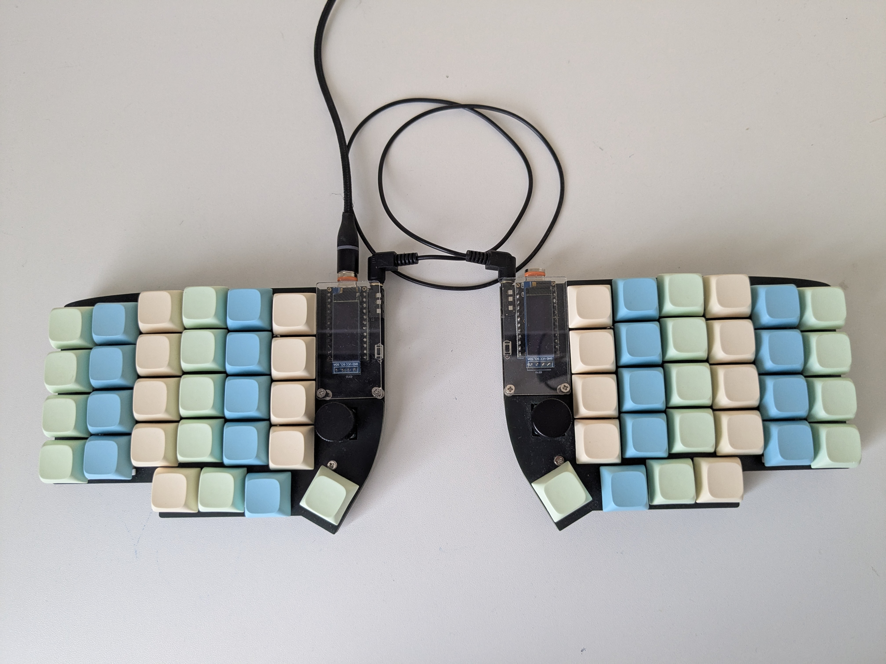
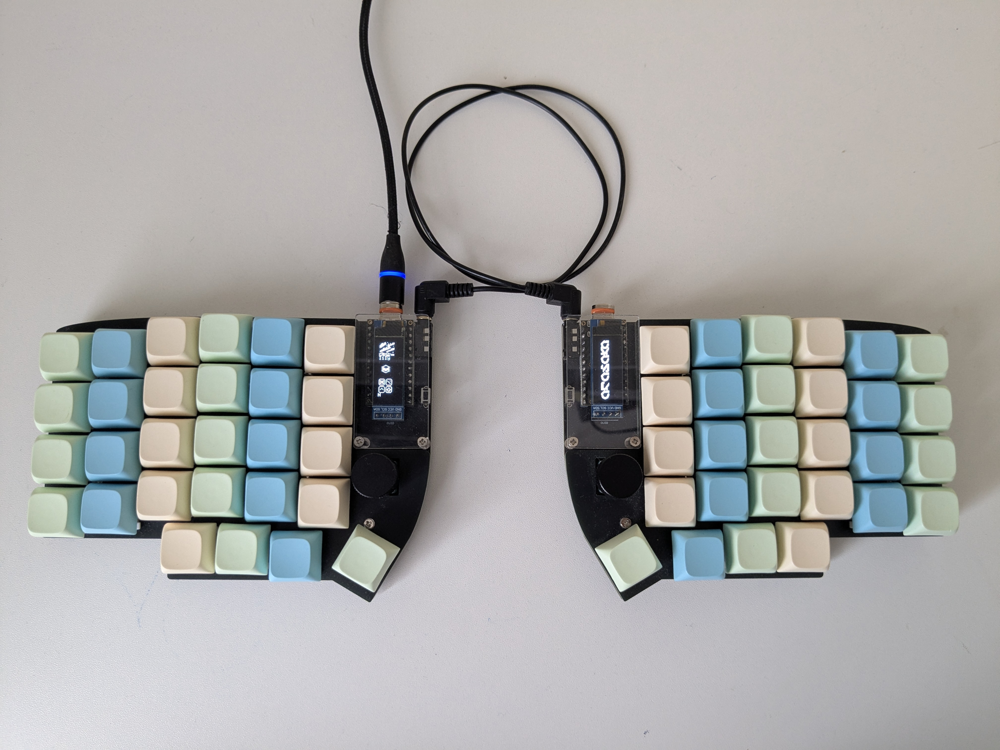
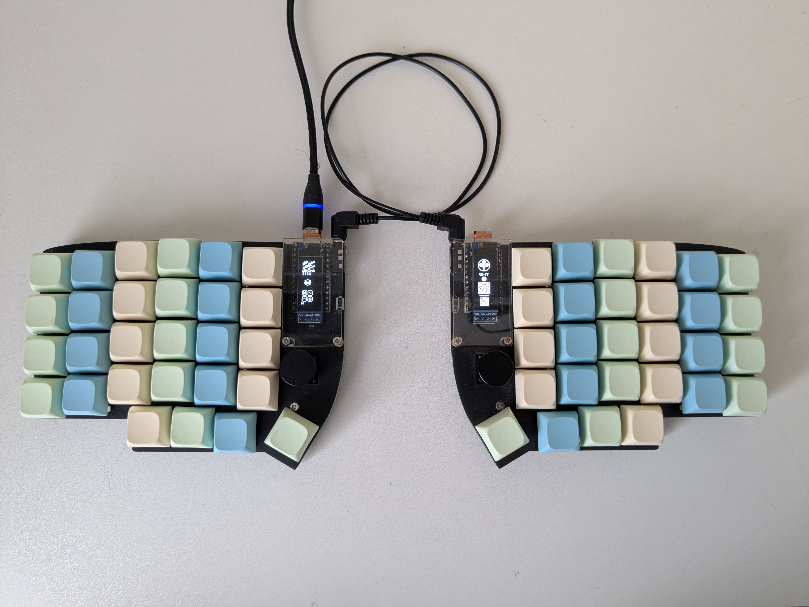

# Lily58
Qmk Firmware for lily58 by [Miocasa](https://github.com/Miocasa/Miocasa)
  

Lily58 is 6×4+5keys column-staggered split keyboard.

  

---
### Keyboard information
Keyboard Maintainer: [Naoki Katahira](https://github.com/kata0510/) [Twitter:@F_YUUCHI](https://twitter.com/F_YUUCHI)

Hardware Supported:Lily58 Pandakb and other PCB's, RP2040 pro micro,

---
### Hardware Availability:

Pandakb lily58 build [kit](https://aliexpress.ru/item/1005007907276743.html?spm=a2g2w.orderdetail.0.0.18914aa6ulC5CE&sku_id=12000042794156476&_ga=2.184145574.181795308.1753952793-1574464728.1753952793)

Sandwich [case ](https://aliexpress.ru/item/1005007908027730.html?spm=a2g2w.orderdetail.0.0.4d6b4aa625NnrJ&sku_id=12000042796161344&_ga=2.187953832.181795308.1753952793-1574464728.1753952793) from textolite and org glass

Xda profile [keykaps](https://aliexpress.ru/item/1005007484383179.html?spm=a2g2w.orderdetail.0.0.710e4aa6eUAkJI&sku_id=12000040960142704&_ga=2.52608040.181795308.1753952793-1574464728.1753952793) 

Encoder [knob](https://aliexpress.ru/item/1005006531154080.html?spm=a2g2w.orderdetail.0.0.58c44aa6LJL7tT&sku_id=12000037552083265&_ga=2.259167754.181795308.1753952793-1574464728.1753952793)

Outemu red [switches](https://aliexpress.ru/item/1005001734115328.html?spm=a2g2w.orderdetail.0.0.3d9b4aa6jcFWua&sku_id=12000017385200063&_ga=2.246542980.181795308.1753952793-1574464728.1753952793)

[TRRS](https://aliexpress.ru/item/4000104350398.html?spm=a2g2w.orderdetail.0.0.3cf14aa6LD9udM&sku_id=10000000271066832&_ga=2.216636054.181795308.1753952793-1574464728.1753952793) cable 

---

### Build/Flash firmware
 `qmk flash -kb lily58_qmk/lily58_my/pandakb -km default`

---

Like my firmware?, please star reposetory 🌟

If you need any help with qmk, you can get contacts on my profile page.